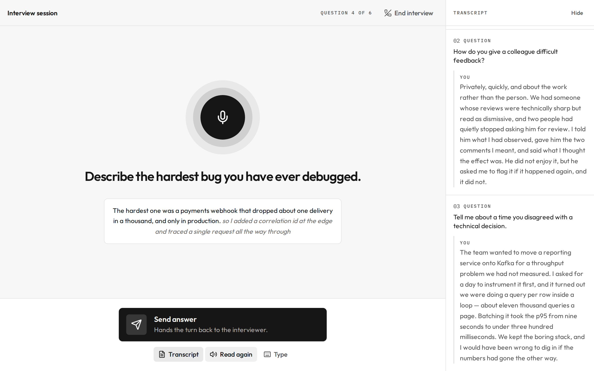
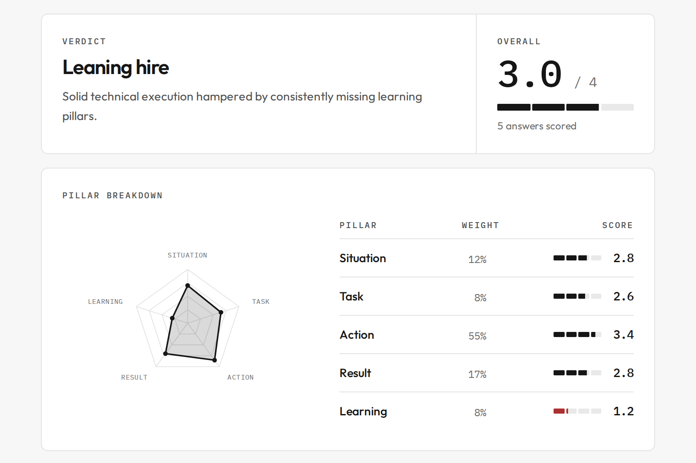
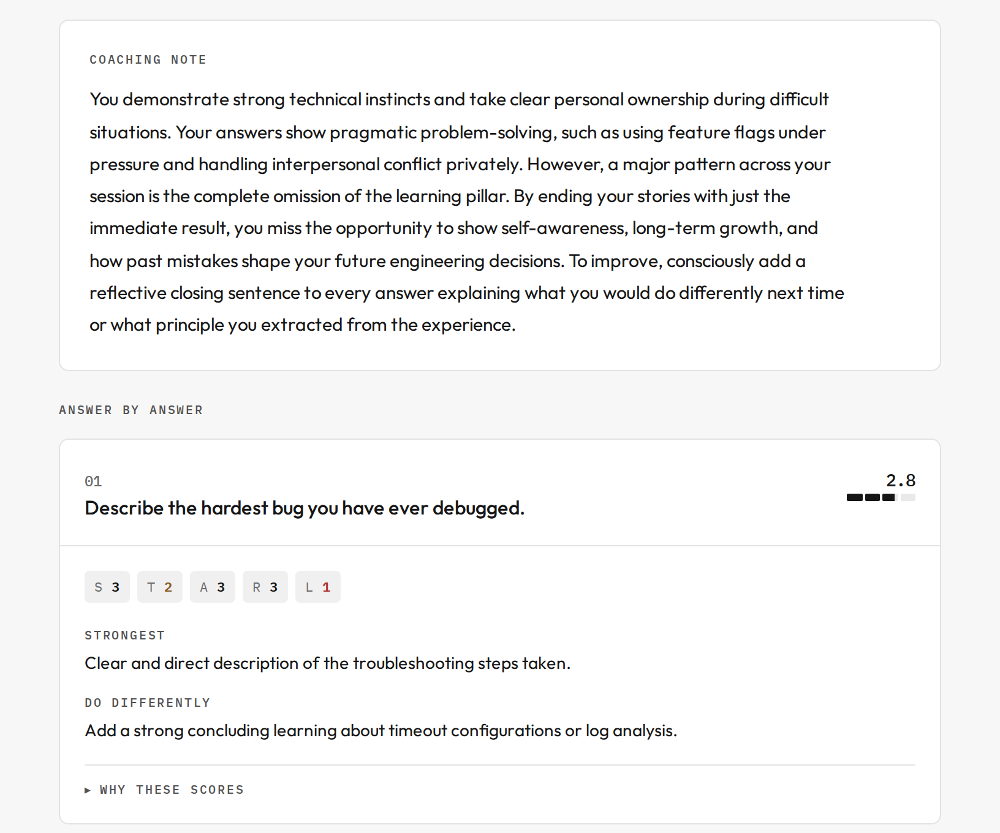
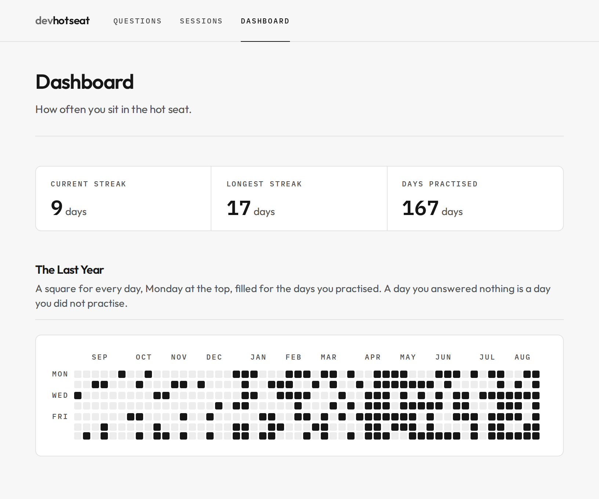

# devhotseat

An AI interview practice tool built for one person. Add interview questions by
hand, practise a session of them one turn at a time, then read the transcript
and an AI-written feedback report afterwards. There is no auth, no
multi-tenancy and no hosted deployment: you start it yourself, and it reaches
out to Google to transcribe your answers and write the report.

<table>
<tr>
<td width="50%"></td>
<td width="50%"></td>
</tr>
<tr>
<td><sub><b>The room.</b> A session runs as a call: one question read aloud, your spoken answer transcribed, then the turn handed back.</sub></td>
<td><sub><b>What it scored.</b> Every answer is marked against the STAR-L rubric, and the shape says which pillar let you down.</sub></td>
</tr>
<tr>
<td width="50%"></td>
<td width="50%"></td>
</tr>
<tr>
<td><sub><b>What it wrote.</b> The same session in sentences: where the answers were thin, then a card for each one.</sub></td>
<td><sub><b>The practice log.</b> A square a day for the last year, and the run you are on.</sub></td>
</tr>
</table>

[The whole report](docs/screenshots/feedback-report-full.png) carries on past
that third tile: a card for every answer, then the transcript it was written
from.

## Prerequisites

| Tool | Version |
| ---- | ------- |
| Node | 24.19.0 (see `.nvmrc`) |
| pnpm | 11.22.0 (pinned via `packageManager`; pnpm fetches the pinned version itself) |
| Docker | Any version with Compose v2, to run Postgres. A PostgreSQL 16+ installed on the host works instead. |
| Browser | Google Chrome. Speech recognition is a hosted service that Brave and some other Chromium builds ship without. |

```bash
nvm install && nvm use
curl -fsSL https://get.pnpm.io/install.sh | sh -
```

## Setup

From the repository root:

```bash
pnpm install
```

### 1. Start the database

```bash
docker compose up -d --wait
```

That creates the `devhotseat` role, the dev database and the test database, and
returns once Postgres is accepting connections. The port is bound to localhost
only. Data sits in a named volume and outlives `docker compose down`; to throw
the transcripts away and start clean, use `docker compose down -v`.

<details>
<summary>Or use a PostgreSQL installed on the host</summary>

Skip the compose file and create the role and both databases yourself.

**macOS (Homebrew)**

```bash
brew install postgresql@18
brew services start postgresql@18
export PATH="/opt/homebrew/opt/postgresql@18/bin:$PATH"

psql postgres -c "CREATE ROLE devhotseat LOGIN PASSWORD 'devhotseat';"
psql postgres -c "CREATE DATABASE devhotseat OWNER devhotseat;"
psql postgres -c "CREATE DATABASE devhotseat_test OWNER devhotseat;"
```

**Linux (Debian / Ubuntu)**

```bash
sudo systemctl enable --now postgresql@18-main

sudo -u postgres psql -p 5432 -c "CREATE ROLE devhotseat LOGIN PASSWORD 'devhotseat';"
sudo -u postgres createdb -p 5432 -O devhotseat devhotseat
sudo -u postgres createdb -p 5432 -O devhotseat devhotseat_test
```

</details>

### 2. Fill in the environment

```bash
cp .env.example .env
```

`devhotseat` works with **Local AI** (via Ollama or LM Studio) or **Google Gemini**:

- **Local AI (Offline / Private, Default)**: Install [Ollama](https://ollama.com/) and pull a model:
  ```bash
  ollama run llama3.2
  ```
  No API key required.

- **Google Gemini API (Higher quality feedback)**: Set `GEMINI_API_KEY` in `.env`.

You can switch between Local AI and Gemini at any time using the toggle in the app header or by editing `AI_PROVIDER` in `.env`.

### 3. Apply the migrations

To the dev database, and then to the test one the integration and e2e suites
use:

```bash
pnpm db:migrate
```

```bash
set -a; . ./.env; set +a
DATABASE_URL="$TEST_DATABASE_URL" pnpm db:migrate
```

## Running it

### Option 1: Docker (One-command practice mode)

Spins up the full stack (Postgres + Production App) in background containers, automatically applying database migrations:

```bash
docker compose up -d --build
```

The app is served at http://localhost:3000. When you are finished studying, shut down the containers (your database data persists in the volume):

```bash
docker compose down
```

### Option 2: Local Development

```bash
docker compose up -d --wait # Starts dev database
pnpm dev                    # Starts Vite dev server
```

The app is served at http://localhost:3000. Add questions on the first page,
start a session once the bank holds at least one, then read the transcript and
report from **Sessions**. A session asks every question in the bank, in random
order, reading each one aloud and transcribing your spoken answer. It runs as a
call screen: entering it reads nothing out until you press to begin, after
which the bar across the bottom is pressed once to start talking and again to
hand your answer back, and the avatar in the middle is filled in only while the
microphone is actually open. You can press to talk over a question
that is still being read, which stops it. Replaying the question and showing
the answers so far sit under the bar.

Before the first press the room shows a short briefing rather than the question,
which is not revealed until it is spoken. **End interview** in the header is the
one way out, and it ends the session there and then: the report is written from
the answers given so far, and you cannot return to it. An interview is never
left in progress. Typing is available at any time via **Type**, and is used
automatically when the browser has no speech support or the microphone is
refused. A session you do not want to keep can be deleted from the **Sessions**
list; its transcript and report go with it.

**Dashboard** is the practice log read as a habit: a square a day for the last
year, filled for every day you practised, with the current and longest streaks
above it. A day counts once a session that started on it has been answered at
all — however many sittings that took — and a streak is not broken by a day
that is not over yet.

## Testing

| Command | Layer | Covers |
| ------- | ----- | ------ |
| `pnpm test:unit` | Vitest, colocated `*.test.ts` | Pure logic — no database, no network |
| `pnpm test:integration` | Vitest, `*.integration.test.ts` | Services against a real Postgres test database, with the report generator stubbed |
| `pnpm test:e2e` | Playwright, `e2e/` | The UI driven against the running stack, with report generation stubbed |

`pnpm test` runs all three in order. The integration and e2e suites use the
test database, truncate between runs, and refuse to start unless the database
name ends in `_test`, so the dev database is never touched.

Playwright needs its browser once:

```bash
pnpm exec playwright install chromium
```

Other checks:

```bash
pnpm typecheck
pnpm lint
```

## Project layout

| Path | Contents |
| ---- | -------- |
| `src/routes` | TanStack Router file routes and the app shell |
| `src/components/ui` | shadcn/ui components |
| `src/components/interview` | The call screen: avatar, controls, transcript panel |
| `src/components/dashboard` | The streak heatmap and its numbers |
| `src/lib` | Query keys, query options, the voice loop, and the practice heatmap |
| `src/fn` | Server functions — the boundary the browser calls |
| `src/server/services` | Question bank and session logic |
| `src/server/session` | The interview state machine |
| `src/server/db` | Drizzle schema and database client |
| `src/server/ai` | Report generator and its prompt |
| `migrations` | Generated SQL migrations |
| `e2e` | Playwright specs |
| `docker` | Postgres init script run by `compose.yaml` |
| `scripts` | Developer scripts — the screenshots above are captured by one |
| `docs/adr` | Decision records |

## Decisions

The reasoning behind each technical choice lives in [`docs/adr/`](docs/adr/).

## License

[GNU AGPL-3.0-only](LICENSE).

Use it, change it, and run it privately without restriction. If you run a
modified version as a service other people reach over a network, section 13
requires you to offer them its source.
